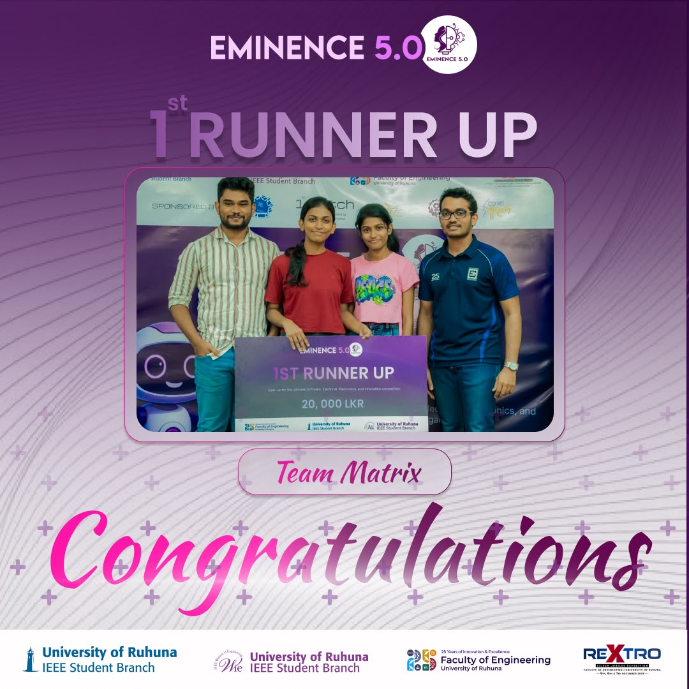

# 🏆 EMINENCE 5.0 (2025) – 2nd Place

  

## About the Achievement

We proudly secured **2nd Place** at **EMINENCE 5.0 (2025)**, a multidisciplinary engineering competition organized by the **Department of Electrical & Information Engineering, University of Ruhuna**.

The competition consisted of four technical challenges:

- MATLAB Challenge
- Artificial Intelligence Challenge
- Cisco Packet Tracer Challenge
- Innovation Challenge

